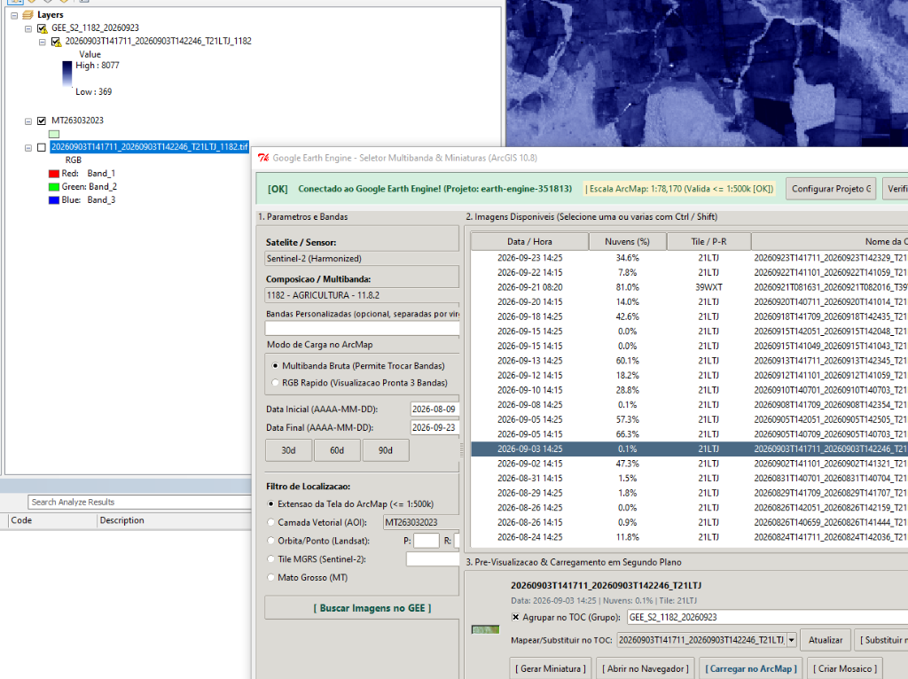
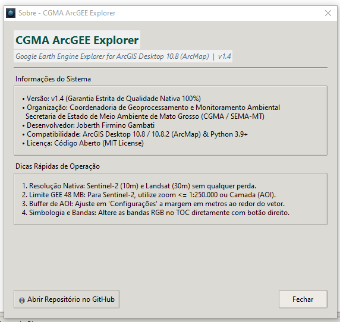

# Manual de Instalação e Operação | CGMA ArcGEE Explorer

<p align="center">
  
</p>

<p align="center">
  <strong>Google Earth Engine integrado ao ArcGIS Desktop (ArcMap 10.8 / 10.8.2)</strong><br>
  <em>Desenvolvido para operações de Sensoriamento Remoto, Geoprocessamento e Fiscalização Ambiental</em><br>
  <strong>Coordenadoria de Geoprocessamento e Monitoramento Ambiental (CGMA / SEMA-MT)</strong>
</p>

---

## 📑 Sumário

1. [Apresentação e Visão Geral](#1-apresentação-e-visão-geral)
2. [Requisitos do Sistema](#2-requisitos-do-sistema)
3. [Configuração da Conta e Projeto no Google Earth Engine](#3-configuração-da-conta-e-projeto-no-google-earth-engine)
4. [Guia de Instalação Passo a Passo](#4-guia-de-instalação-passo-a-passo)
   - [4.1 Instalação Automatizada (Recomendada - 1 Clique)](#41-instalação-automatizada-recomendada---1-clique)
   - [4.2 Instalação Manual](#42-instalação-manual)
   - [4.3 Autenticação Inicial com o Earth Engine](#43-autenticação-inicial-com-o-earth-engine)
5. [Iniciando a Ferramenta no ArcMap](#5-iniciando-a-ferramenta-no-arcmap)
6. [Guia Prático de Operação](#6-guia-prático-de-operação)
   - [6.1 Satélites, Sensores e Períodos Disponíveis](#61-satélites-sensores-e-períodos-disponíveis)
   - [6.2 Composições Coloridas (RGB) e Modo Multibanda Bruta](#62-composições-coloridas-rgb-e-modo-multibanda-bruta)
   - [6.3 Índices Espectrais (NDVI, NDWI, NBR, etc.) e Matemática de Bandas](#63-índices-espectrais-ndvi-ndwi-nbr-etc-e-matemática-de-bandas)
   - [6.4 Filtros Espaciais e Garantia Estrita de Qualidade Nativa 100%](#64-filtros-espaciais-e-garantia-estrita-de-qualidade-nativa-100)
   - [6.5 Busca, Tabela de Resultados e Miniaturas Sob Demanda](#65-busca-tabela-de-resultados-e-miniaturas-sob-demanda)
   - [6.6 Carregamento no TOC, Mosaicos Automáticos e Substituição](#66-carregamento-no-toc-mosaicos-automáticos-e-substituição)
   - [6.7 Painel de Configurações Avançadas (Stretch, DRA e Multicore)](#67-painel-de-configurações-avançadas-stretch-dra-e-multicore)
7. [Atualizações e Manutenção](#7-atualizações-e-manutenção)
8. [Resolução de Problemas Frequentes (FAQ & Troubleshooting)](#8-resolução-de-problemas-frequentes-faq--troubleshooting)
9. [Créditos e Licença](#9-créditos-e-licença)

---

## 1. Apresentação e Visão Geral

O **CGMA ArcGEE Explorer** é uma extensão oficial (Python Add-In) para **ArcGIS Desktop 10.8 e 10.8.2 (ArcMap)** que integra diretamente o poder de processamento em nuvem do **Google Earth Engine (GEE)** ao ambiente cartográfico da ESRI.

Projetado especialmente para fluxos intensivos de sensoriamento remoto, perícias ambientais e monitoramento de cobertura vegetal da **SEMA-MT**, o plugin elimina a necessidade de exportar imagens para o Google Drive ou baixar gigabytes de cenas completas manualmente. 

### Diferenciais Exclusivos:
* **Garantia de Qualidade Nativa 100%:** Nenhuma imagem baixada sofre reamostragem ou rebaixamento espacial. Os pixels do Sentinel-2 permanecem com 10 metros estritos e os do Landsat com 30 metros.
* **Arquitetura Assíncrona Desacoplada:** A interface opera em um processo isolado (`pythonw.exe`) comunicando-se com o ArcMap por IPC seguro via JSON. O ArcMap **nunca trava ou congela** durante downloads ou consultas pesadas.
* **Multibanda Bruta Completa:** Baixa todas as bandas espectrais em um único arquivo GeoTIFF, permitindo ao usuário alterar a composição RGB diretamente no ArcMap TOC em tempo real sem refazer o download.
* **Índices e Fórmulas em Tempo Real:** Cálculos de NDVI, NDWI, NBR, EVI, SAVI e expressões arbitrárias calculadas na nuvem do Google e baixadas em ponto flutuante (Float32).

---

## 2. Requisitos do Sistema

| Componente | Requisito Mínimo | Observação |
| :--- | :--- | :--- |
| **Sistema Operacional** | Windows 10 ou 11 (64-bit) | Windows Server 2016+ também suportado |
| **ArcGIS Desktop** | ArcMap 10.8 ou 10.8.2 | Requer licença funcional (Basic, Standard ou Advanced) |
| **Python do ArcGIS** | Python 2.7 (32-bit padrão) | Localizado em `C:\Python27\ArcGIS10.8\python.exe` |
| **Python do Backend** | Python 3.9, 3.10, 3.11 ou 3.12 (64-bit) | Pode ser o Python oficial, Anaconda, Miniconda ou Python integrado do QGIS 3.x |
| **Bibliotecas Python 3** | `earthengine-api` e dependências | Instalado automaticamente pelo `install.bat` |
| **Conta Google** | Conta cadastrada no Google Earth Engine | Vinculada a um Google Cloud Project ID |
| **Acesso à Rede** | Conexão com a Internet | Acesso livre a `*.googleapis.com` e `earthengine.googleapis.com` |

---

## 3. Configuração da Conta e Projeto no Google Earth Engine

Para utilizar a API do Google Earth Engine, é necessário ter uma conta de acesso e um ID de Projeto no Google Cloud (gratuito para fins não comerciais, ambientais e acadêmicos).

### Passo a Passo para Obter o ID do Projeto:
1. Acesse o portal do Earth Engine: [https://earthengine.google.com/signup/](https://earthengine.google.com/signup/) ou faça login no [Google Earth Engine Code Editor](https://code.earthengine.google.com/).
2. Ao acessar pela primeira vez, o Google solicitará a escolha ou criação de um **Google Cloud Project**.
3. Escolha **"Unpaid commercial / Academic / Government"** ou **"Non-commercial"** e selecione ou crie um projeto (ex: `ee-meu-usuario` ou `projeto-monitoramento-ambiental`).
4. Anote o **Project ID** gerado (ex: `ee-meunome` ou `earth-engine-351813`). Esse ID será inserido no plugin.

> [!TIP]
> Você pode consultar e gerenciar seus projetos do Google Cloud a qualquer momento pelo console: [https://console.cloud.google.com/](https://console.cloud.google.com/).

---

## 4. Guia de Instalação Passo a Passo

<p align="center">
  
</p>

### 4.1 Instalação Automatizada (Recomendada - 1 Clique)

O repositório conta com um instalador completo para Windows (`install.bat`) que automatiza todo o processo de preparação:

1. **Baixe ou clone o repositório:**
   ```cmd
   git clone https://github.com/Yiuky/arcgis-google-earth-engine-explorer.git
   ```
   *(Caso tenha baixado em formato `.zip`, extraia o conteúdo em uma pasta de sua escolha, por exemplo `C:\ArcGEE_Explorer`)*.
2. Certifique-se de que o **ArcMap esteja fechado**.
3. Dê um duplo clique no arquivo **`install.bat`**.
4. O script executará as seguintes ações:
   - Detectará a instalação do ArcGIS Desktop 10.8 e seu Python 2.7.
   - Detectará automaticamente o interpretador Python 3 da sua máquina (procurando no Python padrão, QGIS ou Conda).
   - Instalará ou atualizará a biblioteca `earthengine-api` e requisitos necessários.
   - Empacotará o Add-In `.esriaddin` e o registrará no utilitário ESRI oficial (`ESRIRegAddIn.exe`).
   - Limpará caches de bytecode residuais (`AssemblyCache`), garantindo inicialização limpa.
   - Copiará os templates de simbologia e disponibilizará a caixa de ferramentas `GEE_Tools.pyt`.
5. Ao finalizar, pressione qualquer tecla para fechar o instalador.

---

### 4.2 Instalação Manual

Caso você trabalhe em uma rede corporativa com restrições de execução de scripts `.bat`:

1. **Instalar dependências no seu Python 3:**
   Abra o prompt de comando do seu Python 3 e execute:
   ```cmd
   pip install earthengine-api
   ```
2. **Instalar o Add-In no ArcMap:**
   - Navegue até a subpasta `arcgis_addin`.
   - Dê um duplo clique no arquivo **`GEE_Image_Selector.esriaddin`**.
   - Na janela do utilitário da ESRI (*Esri ArcGIS Add-In Installation Utility*), clique em **Install Add-In**.
   - Será exibida a mensagem: *"Installation succeeded"*.

---

### 4.3 Autenticação Inicial com o Earth Engine

Antes de fazer a primeira consulta, é preciso vincular o token do Google Earth Engine no seu perfil de usuário do Windows:

1. Dê um duplo clique no arquivo **`autenticar_gee.bat`** (localizado na raiz do repositório).
   *(Alternativamente, você pode clicar no botão **"Autenticar GEE"** na janela do plugin dentro do ArcMap)*.
2. Seu navegador de internet padrão será aberto automaticamente na página de autorização do Google.
3. Faça login com a sua conta Google cadastrada no Earth Engine.
4. Conceda as permissões de acesso à API do Google Earth Engine.
5. O navegador confirmará a autorização e o token persistente será salvo em `%USERPROFILE%\.config\earthengine\credentials`.

> [!NOTE]
> Essa autenticação precisa ser feita **apenas uma vez** por máquina/usuário. O token permanecerá válido continuamente.

---

## 5. Iniciando a Ferramenta no ArcMap

1. Abra o **ArcMap 10.8** ou **10.8.2**.
2. Caso a barra de ferramentas não apareça na inicialização:
   - Vá ao menu superior do ArcMap: **Customize** > **Toolbars**.
   - Marque a opção **`CGMA ArcGEE Explorer`** (ou `GEE Image Selector`).
3. Uma barra flutuante será exibida contendo o botão oficial do plugin com o ícone do satélite:
   
   <p align="center">
     <strong>[ 🛰️ ArcGEE Explorer ]</strong>
   </p>

4. Clique no botão. A interface do **CGMA ArcGEE Explorer** abrirá instantaneamente em uma janela moderna independente.
5. **Configurar o Projeto GEE:**
   - No cabeçalho da janela, verifique o status de conexão.
   - Caso esteja em amarelo solicitando o projeto, clique em **`[ Configurar Projeto GEE ]`**.
   - Cole o ID do seu projeto Google Cloud (ex: `ee-meuprojeto`).
   - O indicador ficará verde:  
     `[OK] Conectado ao Google Earth Engine! (Projeto: ee-meuprojeto)`.

---

## 6. Guia Prático de Operação

<p align="center">
  
</p>

### 6.1 Satélites, Sensores e Períodos Disponíveis

O plugin dá suporte a todo o acervo histórico e contemporâneo das missões Sentinel e Landsat. Ao selecionar qualquer satélite no menu suspenso, a interface exibe dinamicamente o intervalo de datas operacionais e a resolução nativa:

| Satélite / Sensor | Coleção Earth Engine | Resolução Nativa | Período Operacional de Dados |
| :--- | :--- | :--- | :--- |
| **Sentinel-2 (Harmonized MSI)** | `COPERNICUS/S2_SR_HARMONIZED` | **10 metros** (B2, B3, B4, B8) | **23/06/2015 até o presente** |
| **Landsat 9 (OLI-2/TIRS-2)** | `LANDSAT/LC09/C02/T1_L2` | **30 metros** | **31/10/2021 até o presente** |
| **Landsat 8 (OLI/TIRS)** | `LANDSAT/LC08/C02/T1_L2` | **30 metros** | **11/04/2013 até o presente** |
| **Landsat 7 (ETM+)** | `LANDSAT/LE07/C02/T1_L2` | **30 metros** | **28/05/1999 até o presente** *(SLC-off após 31/05/2003)* |
| **Landsat 5 (TM)** | `LANDSAT/LT05/C02/T1_L2` | **30 metros** | **16/03/1984 a 05/05/2012** *(Período histórico)* |
| **Landsat 4 (TM)** | `LANDSAT/LT04/C02/T1_L2` | **30 metros** | **22/08/1982 a 14/12/1993** *(Período histórico)* |
| **Landsat 1 a 5 (MSS)** | `LANDSAT/LM01-05/C02/T1` | **60 metros** | **23/07/1972 a 06/01/1999** *(Pioneiro)* |

---

### 6.2 Composições Coloridas (RGB) e Modo Multibanda Bruta

O plugin disponibiliza as combinações de bandas mais utilizadas internacionalmente pela comunidade de sensoriamento remoto:

* **Cor Natural (True Color):** RGB padrão (Vermelho, Verde, Azul). Ideal para interpretação visual direta, inspeção urbana e validação em solo.
* **Agricultura / Vigor Vegetativo:** Combina bandas do infravermelho próximo e ondas curtas (ex: 11-8-2 no Sentinel-2 ou 6-5-2 no Landsat). Realça safras agrícolas e culturas irrigadas em tons verdes brilhantes e solo exposto em magenta/marrom.
* **Falsa Cor Infravermelho (Color Infrared):** Vegetação densa e saudável em vermelho vivo, água em tons escuros/negros e áreas degradadas em ciano.
* **SWIR / Geologia & Solos:** Excelente para diferenciação mineralógica, umidade do solo e penetração através de fumaça e bruma atmosférica.

#### Modos de Carga:
* **Multibanda Bruta (Recomendado):** Baixa todas as bandas espectrais nativas em um único GeoTIFF (ex: 10 bandas no Sentinel-2). Permite ao operador alternar as bandas no ArcMap clicando com o botão direito na camada (`Layer Properties` > `Symbology`) sem necessidade de fazer um novo download.
* **RGB Rápido:** Baixa um arquivo leve contendo estritamente as 3 bandas da composição selecionada.

---

### 6.3 Índices Espectrais (NDVI, NDWI, NBR, etc.) e Matemática de Bandas

Além das composições multiespectrais, o ArcGEE Explorer calcula índices biofísicos diretamente nos servidores do Google Earth Engine, baixando uma camada monocamada Float32 pronta com rampa de cores automática:

* **NDVI (Normalized Difference Vegetation Index):** Mede o vigor fotossintético e biomassa vegetal:
  $$\text{NDVI} = \frac{\text{NIR} - \text{RED}}{\text{NIR} + \text{RED}}$$
* **NDWI (Normalized Difference Water Index):** Destaque de corpos hídricos, represas, rios e áreas alagadas:
  $$\text{NDWI} = \frac{\text{GREEN} - \text{NIR}}{\text{GREEN} + \text{NIR}}$$
* **NDMI (Normalized Difference Moisture Index):** Monitoramento do conteúdo de água e estresse hídrico no dossel foliar:
  $$\text{NDMI} = \frac{\text{NIR} - \text{SWIR1}}{\text{NIR} + \text{SWIR1}}$$
* **NBR (Normalized Burn Ratio):** Detecção e severidade de queimadas e cicatrizes de fogo:
  $$\text{NBR} = \frac{\text{NIR} - \text{SWIR2}}{\text{NIR} + \text{SWIR2}}$$
* **EVI (Enhanced Vegetation Index) & SAVI:** Índices com correção de aerossóis e efeito do substrato do solo.

#### Matemática de Bandas Customizada (Custom Band Math):
Selecione a opção **"Fórmula Personalizada (Band Math)"** e digite qualquer expressão na caixa de texto.
- Exemplo Sentinel-2: `(B8 - B4) / (B8 + B4)` ou `(B8 - B11) / (B8 + B11)`
- Exemplo Landsat 8/9: `(SR_B5 - SR_B4) / (SR_B5 + SR_B4)`

---

### 6.4 Filtros Espaciais e Garantia Estrita de Qualidade Nativa 100%

<p align="center">
  
</p>

O plugin disponibiliza dois métodos principais para definir a região de interesse:

1. **Extensão da Tela do ArcMap (Display Extent):**
   - Utiliza a coordenada visual atual do seu Data Frame no ArcMap.
   - O plugin valida automaticamente a escala. Para garantir a resolução nativa de 10m no Sentinel-2 ou 30m no Landsat, recomenda-se uma escala de **1:250.000 ou menor** (ex: 1:100.000, 1:50.000).
   - Use o botão **`[ Ajustar 1:500.000 ]`** na barra superior para enquadrar a escala segura com 1 clique.

2. **Camada Vetorial (AOI do TOC):**
   - Lista automaticamente todas as camadas vetoriais (Shapefiles, Feature Classes de Geodatabase) abertas na Tabela de Conteúdos do ArcMap.
   - Ao selecionar uma camada vetorial (ex: limite de uma fazenda, terra indígena, unidade de conservação ou imóvel CAR), o plugin recorta **exatamente o polígono** da área de estudo.
   - **Buffer Envolvente de Segurança:** O plugin aplica automaticamente uma margem de proteção (padrão de 1.000 metros, configurável) ao redor do vetor para assegurar que nenhum pixel de borda seja cortado.

> [!TIP]
> **Suporte a Downloads de Áreas Extensas (> 48 MB - Novidade v1.6):**
> O Google Earth Engine possui um teto unitário de 48 MB por requisição. A partir da versão 1.6, o ArcGEE Explorer particiona automaticamente áreas extensas (em escalas de até 1:500.000 ou grandes polígonos AOI) em uma grade de quadrantes seguros, baixados em paralelo multithread e mesclados continuamente via GDAL, garantindo **100% da resolução espacial nativa** (10m no Sentinel-2, 30m no Landsat) sem cancelamentos ou perdas de dados.

---

### 6.5 Busca e Tabela de Resultados

1. Defina a **Data Inicial** e a **Data Final** utilizando o formato brasileiro (`DD/MM/AAAA`) ou os atalhos rápidos (`30d`, `60d`, `90d`).
2. Ajuste o controle deslizante de **Cobertura Máxima de Nuvens** (ex: até 20%).
3. Clique em **`[ Buscar Imagens no GEE ]`**.
4. A tabela listará todas as passagens disponíveis com:
   - **Data / Hora:** Registro exato da passagem orbital.
   - **Nuvens (%):** Cobertura estimada de nebulosidade sobre a cena.
   - **Tile / P-R:** Identificador do tile MGRS (Sentinel-2) ou Path/Row (Landsat).
   - **Nome da Cena:** Identificador oficial completo no acervo do Earth Engine.
   - **Status:** Indicador de cenas já carregadas no ArcMap.

---

### 6.6 Carregamento no TOC e Substituição de Camadas

Com uma ou mais imagens selecionadas na grade:

* **`[ Carregar no ArcMap ]`**:
  Baixa a cena selecionada com 100% de resolução nativa (particionando automaticamente se exceder 48 MB), projeta para as coordenadas do mapa e insere o raster na Tabela de Conteúdos (**TOC**) do ArcMap com **renderização nativa RGB Composite** (`IRasterRGBRenderer`), abrindo os canais Red, Green e Blue no TOC.
* **`[ Substituir no TOC ]`**:
  Atualiza uma camada raster previamente carregada, substituindo seus dados pela nova data sem bagunçar a ordem das camadas no mapa.
* **`[ Aplicar Composição ]` e `[ ⚡ Garantir Stretch ]`**:
  Aplica instantaneamente novas combinações de bandas ou restaura o realce dinâmico (DRA) em camadas existentes no TOC sem precisar refazer downloads.

---

### 6.7 Painel de Configurações Avançadas (v1.7)

Clique no botão **`[ ⚙ Configurações ]`** no canto superior direito para acessar as preferências do sistema, organizadas em abas limpas e com botões de ação fixados na base:

#### Aba 1: Visualização & TOC
1. **Métodos de Realce (Stretch):**
   - **Standard Deviations (Desvio Padrão):** Padrão industrial para sensoriamento remoto (ex: `2.0` desvios padrão).
   - **Dynamic Range Adjustment (DRA):** Realce dinâmico em tempo real ajustado à extensão visível na tela.
   - **Percent Clip:** Realce cortando extremos de histograma (ex: 2% a 98%).
   - **Minimum-Maximum:** Distribui o contraste entre os valores absolutos mínimo e máximo.
2. **Visualização de Camadas no TOC (Novidade v1.7):**
   - **Ativado:** As imagens entram marcadas (`[x]`) e desenhadas no mapa.
   - **Desativado:** As imagens entram desmarcadas (`[ ]`), ideal para carregar lotes de cenas pesadas sem congelar a renderização da tela.

#### Aba 2: Processamento & Sistema
1. **Desempenho e Aceleração Multicore:**
   - Ativação de downloads paralelos e aceleração de estatísticas/pirâmides no ArcMap.
2. **Margem de Buffer da AOI:**
   - Define a margem extra em metros ao redor do retângulo envolvente do vetor (padrão: 1.000m).
3. **Atualização do Plugin:**
   - Acesso direto ao assistente integrado de atualização remota via GitHub ou arquivo ZIP local (processo desacoplado v1.8 sem travas de arquivos).

---

### 6.8 Bandas Personalizadas e Informações do Sensor (v1.8)

1. **Quadro Informativo do Sensor:**
   - O painel azul na coluna lateral exibe dinamicamente o período de operação, a coleção oficial do GEE e a listagem de todas as bandas disponíveis para o satélite selecionado (ex: `B1 a B12` no Sentinel-2, `SR_B1 a SR_B7, ST_B10` no Landsat).
2. **Bandas Personalizadas Resilientes:**
   - Ao selecionar a opção **`CUSTOM_BANDS - BANDAS PERSONALIZADAS`** ou digitar diretamente na caixa de texto bandas separadas por vírgula (ex: `B4,B3,B2` ou `B8,B4,B3`), o plugin baixa as bandas brutas em 100% da resolução nativa e as projeta diretamente como uma composição RGB Composite `(0, 1, 2)` no TOC do ArcMap.
   - O backend realiza auto-detecção de satélite a partir da cena e tradução cruzada de nomenclaturas (ex: `SR_B5` $\leftrightarrow$ `B5`).

---

## 7. Atualizações e Manutenção

O CGMA ArcGEE Explorer conta com sistema próprio e autônomo de atualização:

<p align="center">
  
</p>

### Verificação Automática ao Iniciar
A cada abertura, o plugin verifica silenciosamente no GitHub se há uma versão mais recente disponível. Se houver, uma mensagem discreta aparecerá na barra de status indicando a nova versão.

### Formas de Atualizar:
1. **Pela Interface Gráfica:**
   - Acesse **Configurações (⚙)** > clique em **`[ 🔄 Abrir Assistente de Atualização (GitHub / ZIP) ]`**.
   - Escolha **"Atualizar Diretamente via GitHub"** (faz o download do código mais recente, compila o Add-In e recarrega tudo em 1 clique).
   - Ou escolha **"Selecionar Arquivo ZIP e Atualizar"** caso esteja trabalhando em um ambiente sem acesso direto ao GitHub.
2. **Por Linha de Comando:**
   - Feche o ArcMap e execute o arquivo **`atualizar.bat`** na raiz da pasta do plugin.

### Como Desinstalar:
- Para remover o plugin por completo de forma limpa, feche o ArcMap e dê um duplo clique em **`desinstalar.bat`**. O script encerra processos residuais, desinstala o arquivo `.esriaddin` e limpa o diretório de cache do ArcGIS.

---

## 8. Resolução de Problemas Frequentes (FAQ & Troubleshooting)

### 1. "Aviso: A escala atual do ArcMap é maior que 1:500.000"
* **Causa:** Escalas muito afastadas (ex: 1:1.000.000 ou visão do estado inteiro) cobrem centenas de milhares de quilômetros quadrados, ultrapassando os limites físicos de memória da máquina e da API do GEE.
* **Solução:** Aproxime o zoom no ArcMap para a sua área de trabalho real (escala recomendada entre 1:50.000 e 1:250.000) ou clique no botão **`[ Ajustar 1:500.000 ]`** na barra superior da janela.

### 2. "Como funciona o download de imagens com tamanho superior a 48 MB?"
* **Comportamento v1.6:** O plugin conta com o algoritmo de *Smart Spatial Tiling*. Se a tela ou vetor demandar mais de 48 MB na resolução nativa (ex: uma tela inteira a 1:500.000 gerando 80 MB ou 200 MB), o backend divide a requisição em sub-quadrantes de até 32 MB cada, realiza os downloads concorrentes e os mescla de forma contínua em um GeoTIFF único com GDAL. O processo é 100% transparente para o usuário!

### 3. O botão na barra do ArcMap foi clicado, mas a janela não abre
* **Causa 1:** O interpretador Python 3 não possui a biblioteca `earthengine-api` instalada.
  - *Solução:* Execute o arquivo `install.bat` novamente ou instale manualmente via `pip install earthengine-api`.
* **Causa 2:** Cache de arquivos compilados antigos (`.pyc`) no diretório do ArcGIS.
  - *Solução:* Execute `desinstalar.bat` e em seguida `install.bat` para regenerar o cache limpo.

### 4. "Invalid GeoJSON geometry" ao filtrar por camada vetorial
* **Causa:** O polígono selecionado possui auto-interseções, anéis desconectados ou está em uma projeção cartográfica corrompida.
* **Solução:** A partir da versão 1.4.1, o plugin sanitiza e reprojeta a geometria automaticamente para WGS84 (EPSG:4326). Certifique-se de estar utilizando a versão 1.5.

### 5. Como forçar um Python 3 específico?
* Caso você tenha múltiplos ambientes Python 3 (ex: Anaconda, QGIS, ArcGIS Pro) e queira definir manualmente qual deles deve executar o backend do GEE, crie a variável de ambiente do Windows `GEE_PYTHON3`:
  ```cmd
  setx GEE_PYTHON3 "C:\MeuPython3\python.exe"
  ```

---

## 9. Créditos e Licença

* **Desenvolvedor:** Joberth Firmino Gambati
* **Instituição:** Coordenadoria de Geoprocessamento e Monitoramento Ambiental (CGMA)  
  *Secretaria de Estado de Meio Ambiente de Mato Grosso (SEMA-MT)*
* **Repositório Oficial:** [https://github.com/Yiuky/arcgis-google-earth-engine-explorer](https://github.com/Yiuky/arcgis-google-earth-engine-explorer)
* **Licença:** Código aberto distribuído sob a licença [MIT](LICENSE). Permitido o uso livre para fins governamentais, acadêmicos e comerciais.
